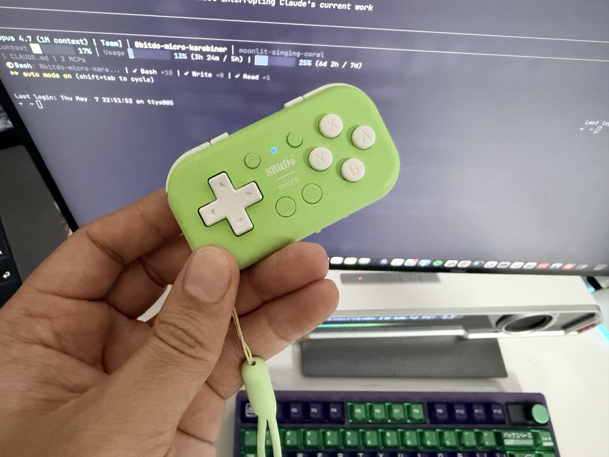
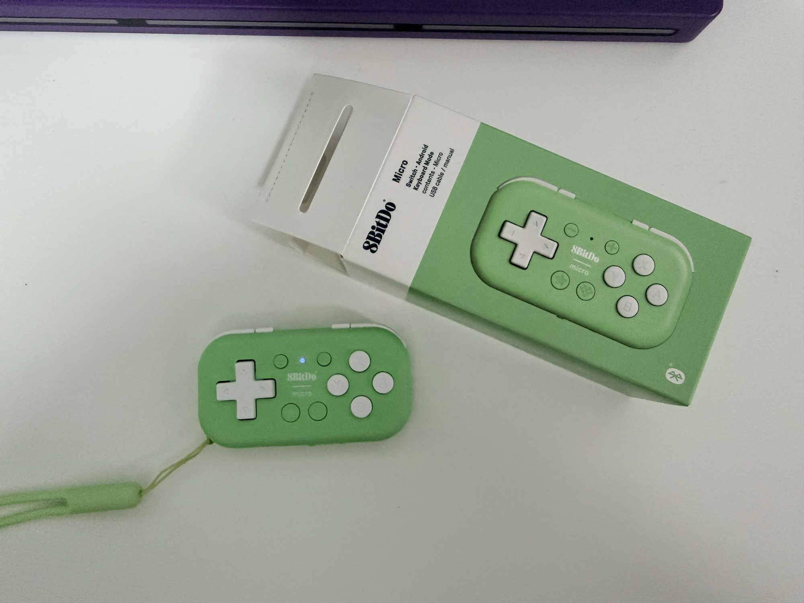
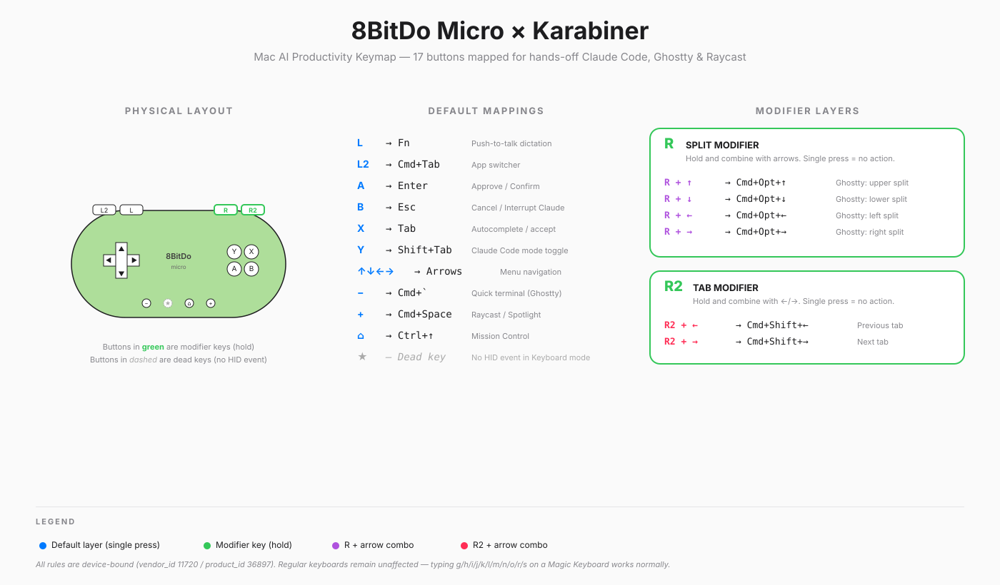

# 8BitDo Micro × Karabiner — Mac AI Productivity Pad

> Turn a 30-gram 8BitDo Micro gamepad into a hardware controller for your **Mac AI workflow**.
>
> Push-to-talk dictation / one-handed Claude Code Approve / Ghostty split + tab navigation / Raycast — all hands-off.

**English** · **[中文](README.md)**

<p align="center">
  
</p>

---

## ✨ What it does

- 🎙️ **Push-to-talk dictation** — Hold L to talk, release to stop (works with macOS Dictation, Typeless, Whisper, etc.)
- ✅ **One-handed Claude Code Approve** — A = Enter (confirm), B = Esc (cancel/interrupt), D-pad navigates options
- 🪟 **Ghostty terminal nav** — Hold R + arrows for split nav, hold R2 + ←/→ for tab nav
- 🚀 **Global AI launcher** — Start summons Raycast/Spotlight, Select summons Ghostty Quick Terminal
- 🧭 **App switching** — L2 = Cmd+Tab, Home = Mission Control
- 🛡️ **Zero conflicts** — Rules are bound to the 8BitDo device ID only; your other keyboards type normally

All rules apply system-wide — Claude Code, Cursor, Ghostty, browsers, anywhere.

---

## 🗺️ Full keymap

<p align="center">
  
  <br/>
  <em>8BitDo Micro green edition — only 30g, fits one hand.</em>
</p>

<p align="center">
  
</p>

### Default layer (no modifier)

| Physical button | Maps to | Purpose |
|---|---|---|
| **L** shoulder | `Fn` | 🎙️ Push-to-talk dictation (hold to talk, release to stop) |
| **L2** trigger | `Cmd+Tab` | App switcher |
| **R** shoulder | *Modifier layer 1 (split)* | Single press = no action; hold to enter split-nav layer |
| **R2** trigger | *Modifier layer 2 (tab)* | Single press = no action; hold to enter tab-nav layer |
| **A** | `Enter` | ✅ Confirm / Approve |
| **B** | `Esc` | ❌ Cancel / interrupt Claude / dismiss dialogs |
| **X** | `Tab` | Autocomplete / accept ghost text |
| **Y** | `Shift+Tab` | Claude Code mode toggle (Plan / Auto-Edit / Normal) |
| **↑↓←→** D-pad | Arrows | Navigate menus / options / vim / less |
| **Select (−)** | `Cmd+\`` | Summon Ghostty Quick Terminal (global hotkey) |
| **Start (+)** | `Cmd+Space` | Summon Raycast / Spotlight |
| **Home ⌂** | `Ctrl+↑` | Mission Control (window overview) |
| **Star ★** | — | Dead key in Keyboard mode (no HID event emitted) |

### Modifier layers (hold R or R2)

| Combo | Maps to | Purpose |
|---|---|---|
| **R + ↑** | `Cmd+Opt+↑` | Ghostty: go to upper split |
| **R + ↓** | `Cmd+Opt+↓` | Ghostty: go to lower split |
| **R + ←** | `Cmd+Opt+←` | Ghostty: go to left split |
| **R + →** | `Cmd+Opt+→` | Ghostty: go to right split |
| **R2 + ←** | `Cmd+Shift+←` | Ghostty: previous tab |
| **R2 + →** | `Cmd+Shift+→` | Ghostty: next tab |

> 💡 **Design rationale**: R / R2 sit on the right side, arrows on the left. Modifier and target on different hands — no thumb fighting itself for the same key. That's why L2 isn't the modifier.

---

## 🚀 30-second install

### Prerequisites

| Tool | Version | Install |
|---|---|---|
| [Karabiner-Elements](https://karabiner-elements.pqrs.org/) | 14+ | `brew install --cask karabiner-elements` |
| 8BitDo Micro pad | Any | [Official site](https://www.8bitdo.com/micro/) |

### Step 1: Switch the 8BitDo to Keyboard mode

The 8BitDo Micro has a **3-position physical slide switch** on the bottom edge labeled `s` / `d` / `k` — **slide it to `k`** for Keyboard mode. macOS will then recognize it as a Bluetooth keyboard.

| Position | Mode | Use case |
|---|---|---|
| `s` | **S**witch | Nintendo Switch console |
| `d` | **D**-input | Android / Windows generic gamepad |
| **`k`** | **K**eyboard ⭐ | **Mac / iOS as a Bluetooth keyboard — required for this repo** |

> 💡 No button combo, no power-cycle. Slide the switch and it takes effect immediately. In Keyboard mode the pad emits standard HID keyboard events that Karabiner can intercept.

### Step 2: Pair with your Mac

System Settings → Bluetooth → find "8BitDo Micro gamepad" → Pair.

### Step 3: Import the Karabiner rule (pick one)

#### Method A: URL import (recommended)

Paste this URL into your browser address bar and hit Enter. Karabiner will pop up an import dialog:

```
karabiner://karabiner/assets/complex_modifications/import?url=https://raw.githubusercontent.com/HarrisHan/8bitdo-micro-karabiner/main/config/8bitdo-micro-rule.json
```

Click "Import" → "Enable All" and you're done.

#### Method B: Manually copy the JSON

1. Open Karabiner-Elements → `Complex Modifications` tab → `Add predefined rule`
2. Copy the contents of [`config/8bitdo-micro-rule.json`](config/8bitdo-micro-rule.json) to:
   ```
   ~/.config/karabiner/assets/complex_modifications/8bitdo-micro-rule.json
   ```
3. Click `Enable All` in the Karabiner UI

#### Method C: Replace your entire karabiner.json

⚠️ This overwrites all your existing rules. **Only do this on a fresh install.**

```bash
cp ~/.config/karabiner/karabiner.json ~/.config/karabiner/karabiner.json.bak
curl -L https://raw.githubusercontent.com/HarrisHan/8bitdo-micro-karabiner/main/config/karabiner.json \
  -o ~/.config/karabiner/karabiner.json
```

### Step 4: Test

Open any text input box:

- Press **A** on the pad → should produce Enter
- Press **B** → should produce Esc
- Press **arrows** → should move cursor up/down/left/right
- **Hold R + arrow** → should produce Cmd+Opt+arrow (visible as split-focus change in Ghostty with multiple splits)

---

## 💡 Recommended use cases

### Use case 1: Walk-around Claude Code conversations

> Hold the pad in one hand and pace around the room — run your AI workflow with just push-to-talk + Approve.

1. Hold **L** and speak → macOS Dictation / Typeless transcribes into the Claude Code input box
2. Release **L** → recording stops
3. Press **A** → submit (Enter)
4. Claude proposes a plan; press the **D-pad** to navigate Approve / Reject options
5. Press **A** → confirm  /  press **B** → cancel
6. Claude going off the rails? Press **B** → Esc to interrupt

### Use case 2: 4-split Ghostty dev layout

> One Ghostty window split four ways. Type code with one hand, switch focus with the pad in the other.

```
┌─────────────┬─────────────┐
│  Claude     │  pnpm dev   │  ← R+→ to switch here
│  Code       │  watch      │
├─────────────┼─────────────┤
│  git        │  log tail   │
│  status     │             │
└─────────────┴─────────────┘
```

- **R + arrow** = switch split
- **R2 + ←/→** = switch top tab (handy when juggling several projects)

### Use case 3: "Stealth mode" during meetings / talks

> Keep your hands on stage but secretly drive your Mac with the pad:
> - **Start** to summon Raycast and search anything
> - **Select** to summon Quick Terminal for an ad-hoc command
> - **Home** for a window overview to jump fast
> - **L2** for Cmd+Tab between apps

---

## 🛠️ Customization

The full ruleset lives in [`config/8bitdo-micro-rule.json`](config/8bitdo-micro-rule.json). Each manipulator is an independent rule with a simple structure:

```jsonc
{
    "type": "basic",
    "conditions": [
        {
            "type": "device_if",
            "identifiers": [{
                "vendor_id": 11720,        // 8BitDo Micro
                "product_id": 36897,
                "is_keyboard": true
            }]
        }
    ],
    "from": { "key_code": "g" },           // keycode that 8BitDo's A button emits
    "to": [{ "key_code": "return_or_enter" }] // map to Enter
}
```

### Change a button's function

1. Use Karabiner-EventViewer to capture the keycode your button emits (see FAQ below)
2. Find the matching manipulator in `config/8bitdo-micro-rule.json` and edit the `to` field

### Add a modifier combo

Follow the R / R2 pattern:

```jsonc
// 1) Make X a modifier key
{
    "from": { "key_code": "h" },           // keycode X emits
    "to": [{ "set_variable": { "name": "x_layer", "value": 1 }}],
    "to_after_key_up": [{ "set_variable": { "name": "x_layer", "value": 0 }}]
},
// 2) X + ↑ triggers a custom action
{
    "conditions": [{ "type": "variable_if", "name": "x_layer", "value": 1 }],
    "from": { "key_code": "c" },           // keycode ↑ emits
    "to": [{ "key_code": "p", "modifiers": ["left_command", "left_shift"] }]  // Cmd+Shift+P
}
```

---

## 🐛 FAQ / Troubleshooting

### Q: My 8BitDo isn't responding

Check these 5 things:

1. The slide switch is on **`k`** (Keyboard mode)
2. macOS Bluetooth shows the pad as **Connected**
3. Karabiner-Elements main window has a **green Status** light (no errors)
4. The rule is **Enabled** under `Complex Modifications`
5. Press **g** on your **regular Magic Keyboard** — it should type `g`. If `g` becomes Enter, your `device_if` isn't matching; double-check `vendor_id` / `product_id`.

### Q: My 8BitDo's A button doesn't emit `g` like yours does

Different 8BitDo Micro firmware revisions can produce different keycodes. Capture **your** pad's keycodes:

1. Open `/Applications/Karabiner-EventViewer.app`
2. Switch to the `Main` tab
3. Press each 8BitDo button and note the `key_code` field
4. Switch to the `Devices` tab and note the pad's `vendor_id` and `product_id`
5. Edit [`config/8bitdo-micro-rule.json`](config/8bitdo-micro-rule.json) and replace the `from.key_code` and `vendor_id` / `product_id` values with yours

Or list devices via CLI:

```bash
"/Library/Application Support/org.pqrs/Karabiner-Elements/bin/karabiner_cli" --list-connected-devices
```

### Q: Holding L doesn't trigger push-to-talk

`L` emits `fn`, but whether that actually starts dictation depends on your software:

- **macOS Dictation** — System Settings → Keyboard → Dictation → Shortcut → set to **`Hold Fn key`**
- **Typeless / Whisper / SuperWhisper** — follow the app's own shortcut config
- If the app uses toggle mode (press once to start, press again to stop), push-to-talk becomes "press once on hold, stop on release" — usually still acceptable

### Q: Pressing g/h/i/j/k on my regular keyboard now produces Enter/Tab/Shift-Tab/Esc/Fn!

The `device_if` filter isn't matching — your `vendor_id` is probably different. Run:

```bash
"/Library/Application Support/org.pqrs/Karabiner-Elements/bin/karabiner_cli" --list-connected-devices | grep -A 5 -i 8bitdo
```

Replace the real `vendor_id` / `product_id` values into the JSON.

### Q: Single-pressing R / R2 has a 0.5-second delay

Normal — Karabiner is waiting to see whether you'll combine it with another key. To eliminate the delay you can switch to `to_if_alone` mode (single press emits something), but then R / R2 can't be a pure modifier anymore.

### Q: Where did the screenshot shortcut go?

The original config had R2 = `Cmd+Shift+5` (screenshot panel), but it was repurposed into a tab modifier. To reclaim screenshot:

- macOS built-in shortcuts: `Cmd+Shift+4` for area screenshot, `Cmd+Shift+5` for the screenshot/recording panel — your regular keyboard still works
- Or: in 8BitDo Ultimate Software, remap the **Star ★** key to emit a real keycode and add a new manipulator for it in this rule

---

## 🗂️ Repo structure

```
.
├── README.md                      # Chinese version
├── README.en.md                   # English version (this file)
├── LICENSE
├── config/
│   ├── 8bitdo-micro-rule.json     # ⭐ Karabiner Complex Modification — use this for import
│   └── karabiner.json             # full karabiner.json reference
└── images/
    ├── hero.jpg                   # workflow scene
    ├── product.jpg                # product + packaging
    └── keymap.svg                 # full keymap diagram (SVG, GitHub-rendered)
```

---

## 🤝 Contributing

PRs welcome!

- Improve docs / add translations / contribute example imagery
- Adapt for other models (8BitDo Zero 2 / Lite 2 / Pro 2 ...)
- Add more modifier-layer combos (screenshot → AI, command palette, tmux integration ...)

If you fork and adapt to your own workflow, drop a link in an issue and I'll roll them up here.

---

## 📜 License

MIT — fork, modify, commercialize, all welcome.

---

## 🙏 Credits

- [Karabiner-Elements](https://karabiner-elements.pqrs.org/) by Takayama Fumihiko
- [8BitDo Micro](https://www.8bitdo.com/micro/) by 8BitDo
- [Ghostty](https://ghostty.org/) by Mitchell Hashimoto
- Inspired by the vibecoding / single-handed AI workflow exploration

If this repo helps you, **a Star ⭐** is the best feedback.

---

<p align="center">
  Made with 🎮 + ⌨️ + 🤖 by <a href="https://github.com/HarrisHan">@HarrisHan</a>
</p>
